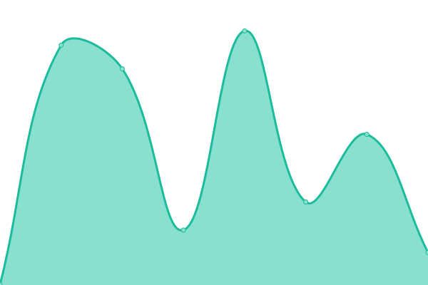
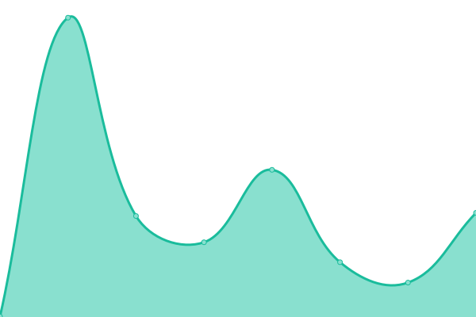
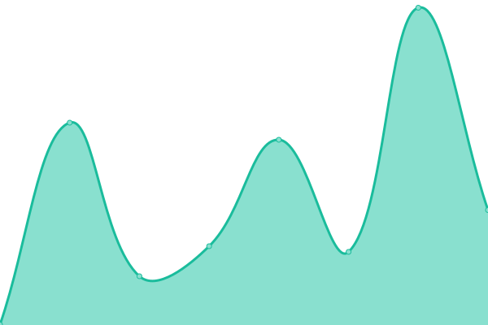
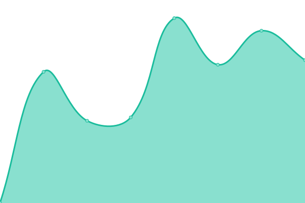

# [📈 Live Status](https://ca.banks.downly.net): <!--live status--> **🟧 Partial outage**

This repository contains the open-source uptime monitor and status page for [Upptime](https://upptime.js.org), powered by [Upptime](https://github.com/upptime/upptime).

With [Upptime](https://upptime.js.org), you can get your own unlimited and free uptime monitor and status page, powered entirely by a GitHub repository. We use [Issues](https://github.com/upptime/upptime/issues) as incident reports, [Actions](https://github.com/Downly-Net/Downly/actions) as uptime monitors, and [Pages](https://ca.banks.downly.net) for the status page.

<!--start: status pages-->
<!-- This summary is generated by Upptime (https://github.com/upptime/upptime) -->
<!-- Do not edit this manually, your changes will be overwritten -->
<!-- prettier-ignore -->
| URL | Status | History | Response Time | Uptime |
| --- | ------ | ------- | ------------- | ------ |
|  [Royal Bank of Canada](https://www.rbcroyalbank.com) | ✅ Up | [royal-bank-of-canada.yml](https://github.com/Thexyz/Canadian-Banks-Monitoring/commits/HEAD/history/royal-bank-of-canada.yml) | 

 381ms
     
 | 

<a href="https://ca.banks.downly.net/history/royal-bank-of-canada">100.00%</a>
    

|  [Toronto-Dominion Bank](https://www.td.com) | ✅ Up | [toronto-dominion-bank.yml](https://github.com/Thexyz/Canadian-Banks-Monitoring/commits/HEAD/history/toronto-dominion-bank.yml) | 

 684ms
     
 | 

<a href="https://ca.banks.downly.net/history/toronto-dominion-bank">100.00%</a>
    

|  [Bank of Nova Scotia](https://www.scotiabank.com) | ✅ Up | [bank-of-nova-scotia.yml](https://github.com/Thexyz/Canadian-Banks-Monitoring/commits/HEAD/history/bank-of-nova-scotia.yml) | 

 272ms
     
 | 

<a href="https://ca.banks.downly.net/history/bank-of-nova-scotia">100.00%</a>
    

|  [Bank of Montreal](https://www.bmo.com) | ✅ Up | [bank-of-montreal.yml](https://github.com/Thexyz/Canadian-Banks-Monitoring/commits/HEAD/history/bank-of-montreal.yml) | 

 787ms
     
 | 

<a href="https://ca.banks.downly.net/history/bank-of-montreal">100.00%</a>
    

|  [CIBC](https://www.cibc.com) | ✅ Up | [cibc.yml](https://github.com/Thexyz/Canadian-Banks-Monitoring/commits/HEAD/history/cibc.yml) | 

 633ms
     
 | 

<a href="https://ca.banks.downly.net/history/cibc">100.00%</a>
    

|  [National Bank of Canada](https://www.nbc.ca) | ✅ Up | [national-bank-of-canada.yml](https://github.com/Thexyz/Canadian-Banks-Monitoring/commits/HEAD/history/national-bank-of-canada.yml) | 

 431ms
     
 | 

<a href="https://ca.banks.downly.net/history/national-bank-of-canada">100.00%</a>
    

|  [HSBC Canada](https://www.hsbc.ca) | ✅ Up | [hsbc-canada.yml](https://github.com/Thexyz/Canadian-Banks-Monitoring/commits/HEAD/history/hsbc-canada.yml) | 

 764ms
     
 | 

<a href="https://ca.banks.downly.net/history/hsbc-canada">100.00%</a>
    

|  [Laurentian Bank of Canada](https://www.laurentianbank.ca) | ✅ Up | [laurentian-bank-of-canada.yml](https://github.com/Thexyz/Canadian-Banks-Monitoring/commits/HEAD/history/laurentian-bank-of-canada.yml) | 

 897ms
     
 | 

<a href="https://ca.banks.downly.net/history/laurentian-bank-of-canada">100.00%</a>
    

|  [Canadian Western Bank](https://www.cwbank.com) | 🚨 Down | [canadian-western-bank.yml](https://github.com/Thexyz/Canadian-Banks-Monitoring/commits/HEAD/history/canadian-western-bank.yml) | 

 105ms
     
 | 

<a href="https://ca.banks.downly.net/history/canadian-western-bank">0.00%</a>
    

<!--end: status pages-->

[**Visit our status website →**](https://ca.banks.downly.net)

## 📄 License

- Powered by: [Upptime](https://github.com/upptime/upptime)
- Code: [MIT](./LICENSE) © [Upptime](https://upptime.js.org)
- Data in the `./history` directory: [Open Database License](https://opendatacommons.org/licenses/odbl/1-0/)
